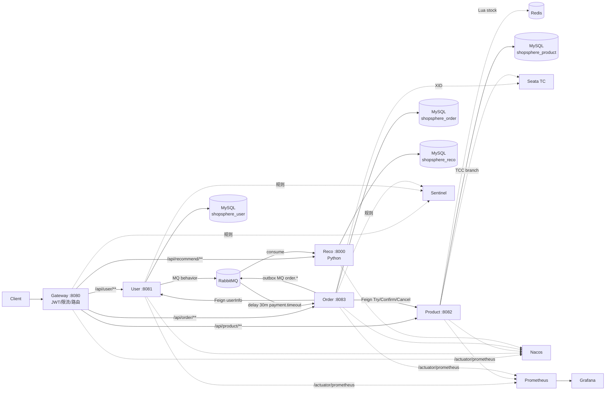

# ShopSphere

> 微服务电商平台 — Java(Spring Cloud Alibaba)+ Python(FastAPI)异构。
> 自带 **1000 并发抗超卖 + TCC 一致性 + 推荐冷启动 fallback** 验收门。

[]()
[]()
[]()
[](LICENSE)

---

## 核心特性

- **抗超卖** — Seata TCC(显式三段)+ Redis Lua 原子预扣 + 本地消息表;1000 并发 / 500 库存验收无超卖、TCC 三段账平、Redis/DB 一致
- **网关统一鉴权** — JWT RS256 在 Gateway 校验,业务服务零鉴权代码(只读 `X-User-Id` 等头)
- **异构推荐** — Python FastAPI + ItemCF 离线训练;事件驱动,推荐服务自有库(不跨服务读 DB);冷启动 fallback 永不返 5xx
- **全链可观测** — Sentinel(Nacos 热加载规则)+ Prometheus + Grafana + JMeter HTML 报告
- **一键起栈** — docker compose + profile(java/python/monitoring);健康探活 + 就绪等待脚本

---

## 架构图



> 详见 [docs/architecture.md](docs/architecture.md)(完整流程图 + ADR 摘要)。

---

## 技术栈

| 类别 | 选型 | 版本 |
|---|---|---|
| 框架 | Spring Boot / Spring Cloud / Spring Cloud Alibaba | 3.2.5 / 2023.0.1 / 2023.0.1.0 |
| JDK / Python | OpenJDK / CPython | 17 / 3.11 |
| 注册 + 配置 | Nacos | 2.3.2 |
| 分布式事务 | Seata(TCC 模式) | 1.8.0 |
| 限流 / 熔断 | Sentinel(Nacos 数据源) | 1.8.8 |
| 消息 | RabbitMQ + `delayed-message-exchange` 插件 | 3.13 |
| 缓存 | Redis | 7.2 |
| 数据库 | MySQL | 8.0.36 |
| ORM | MyBatis-Plus(Boot3) | 3.5.7 |
| Python Web | FastAPI / Uvicorn / APScheduler | 0.110 / 0.29 / 3.x |
| 压测 | Apache JMeter | 5.6.3 |
| 可观测 | Prometheus + Grafana | 2.51 / 10.4 |

---

## 快速启动(3 步)

```bash
# 1. 复制环境变量(默认值即可本地开发)
cp .env.example .env

# 2. 起完整栈(基础设施 + 4 Java + 1 Python + 监控)
docker compose --profile java --profile python up -d --build

# 3. 等就绪 + 烟雾测试
bash scripts/wait-stack-healthy.sh
bash scripts/e2e-recommend.sh    # 端到端调一次
```

访问入口:

- 网关:`http://localhost:8080`
- Nacos:`http://localhost:8848/nacos`(账密 `nacos/nacos`)
- Sentinel 控制台:`http://localhost:8858`
- RabbitMQ 管理:`http://localhost:15672`(账密见 `.env`)
- Seata 控制台:`http://localhost:7091`(`seata/seata`)
- Prometheus:`http://localhost:9090`
- Grafana:`http://localhost:3000`(账密见 `.env`)

完整部署、profile 说明、生产差异见 [docs/deployment.md](docs/deployment.md)。

---

## 服务一览

| 服务 | 端口 | 一句话职责 | README |
|---|---|---|---|
| `shopsphere-gateway` | 8080 | 入口 + JWT(RS256)+ Sentinel 限流 + 路由(Nacos discovery) | [README](shopsphere-gateway/README.md) |
| `shopsphere-user` | 8081 | 注册 / 登录(JWT 签发)/ me / 行为埋点 MQ 投递 | [README](shopsphere-user/README.md) |
| `shopsphere-product` | 8082 | 商品 CRUD / Cache-Aside / Redis 库存 Lua / 库存 TCC | [README](shopsphere-product/README.md) |
| `shopsphere-order` | 8083 | 下单 / 支付 / 取消 / TCC 发起方 / 本地消息表 / 30 min 延迟取消 | [README](shopsphere-order/README.md) |
| `shopsphere-recommendation` | 8000 | Python:ItemCF 离线训练 + 在线召回 + 行为事件消费 | [README](shopsphere-recommendation/README.md) |
| `shopsphere-common` | — | Result / ErrorCode / JWT util / 全局异常 / Header 常量 | [README](shopsphere-common/README.md) |
| `shopsphere-api` | — | Feign 契约模块(user-api / product-api / order-api) | [README](shopsphere-api/README.md) |
| `shopsphere-e2e-test` | — | 端到端测试套件(register → browse → order → recommend) | [README](shopsphere-e2e-test/README.md) |

---

## 文档导航

| 主题 | 文件 |
|---|---|
| 架构总览 + ADR 摘要 | [docs/architecture.md](docs/architecture.md) |
| API 契约(所有对外接口 + 错误码) | [docs/api-contracts.md](docs/api-contracts.md) |
| 部署指南(docker / Nacos / 生产差异) | [docs/deployment.md](docs/deployment.md) |
| 排障手册(Nacos / Seata / TCC / MQ / JWT) | [docs/troubleshooting.md](docs/troubleshooting.md) |
| 架构决策(ADR) | [docs/adr/](docs/adr/) |
| 压测报告(T5.3 验收) | [docs/perf-tcc-report.md](docs/perf-tcc-report.md) |
| 发布核验单 | [docs/release-checklist.md](docs/release-checklist.md) |
| 变更日志 | [CHANGELOG.md](CHANGELOG.md) |

专项细节:

- 库存设计:[docs/stock-redis.md](docs/stock-redis.md)
- Seata 集成验证:[docs/seata-verify.md](docs/seata-verify.md)
- TCC 失败回归:[docs/tcc-rollback-report.md](docs/tcc-rollback-report.md)
- MQ 拓扑:[docs/mq-topology.md](docs/mq-topology.md)
- 限流规则:[docs/sentinel-rules.md](docs/sentinel-rules.md)
- 推荐集成:[docs/integration-recommend.md](docs/integration-recommend.md)
- 压测脚本说明:[perf/README.md](perf/README.md)

---

## 仓库布局

```
.
├── shopsphere-common/          # Result/ErrorCode/JWT/异常/Header
├── shopsphere-api/             # Feign 契约(user/product/order)
├── shopsphere-gateway/         # 入口:JWT + 路由 + Sentinel
├── shopsphere-user/            # 用户 + 行为埋点
├── shopsphere-product/         # 商品 + 库存 TCC
├── shopsphere-order/           # 订单 + TCC 发起 + 本地消息表
├── shopsphere-recommendation/  # Python 推荐(FastAPI)
├── shopsphere-e2e-test/        # 端到端测试
├── docs/                       # 文档(契约/部署/ADR/排障…)
├── monitoring/                 # Prometheus + Grafana 配置
├── perf/                       # JMeter 压测计划 + 编排脚本
├── scripts/                    # nacos-config-push / wait-stack-healthy / 等
├── rabbitmq/                   # 自定义 RabbitMQ(预装延迟插件)
├── seata/                      # Seata server 配置
└── docker-compose.yml          # 一键栈
```

---

## License

[MIT](LICENSE)
